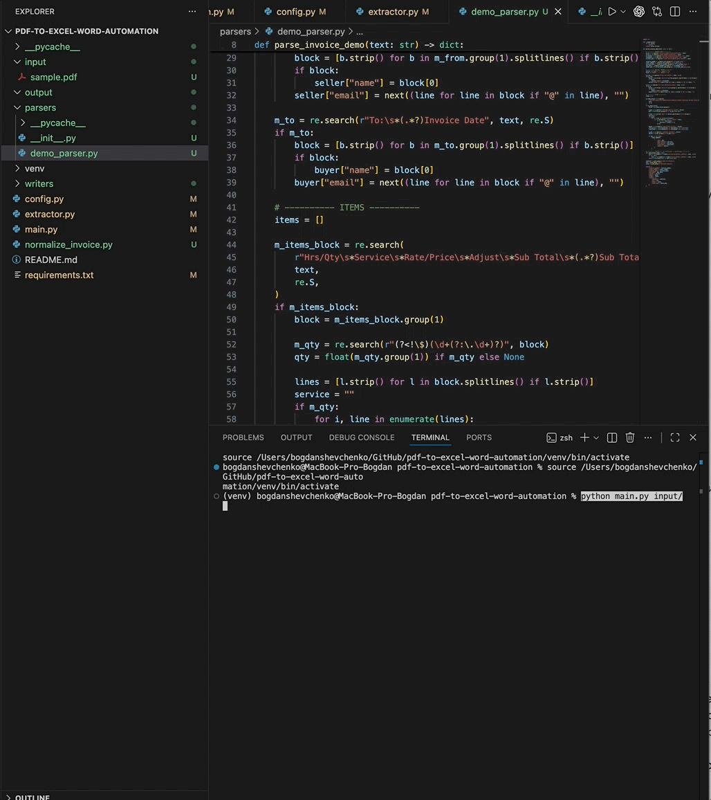
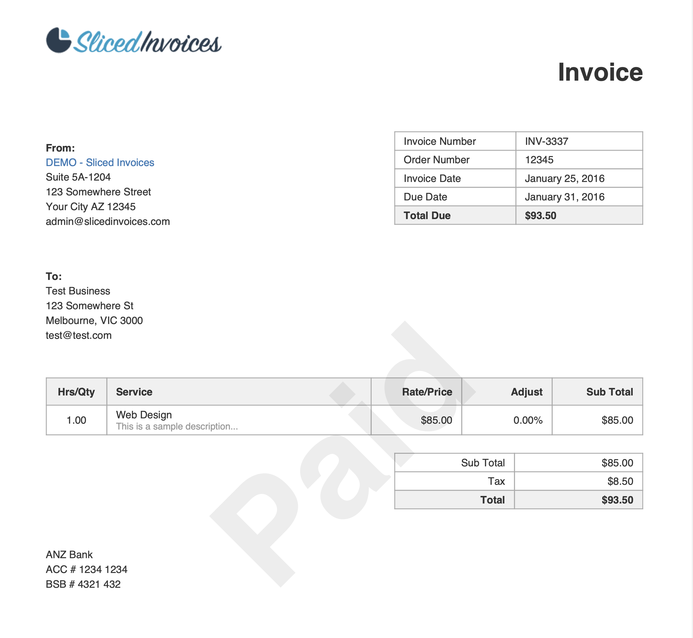
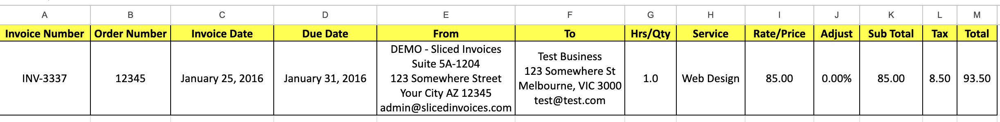
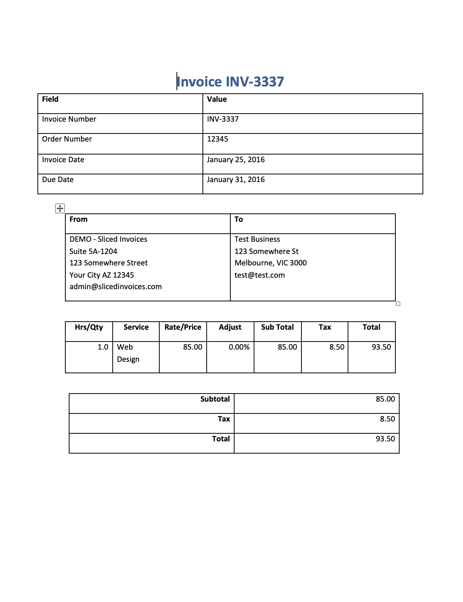

<h1 align="center">📄 PDF Invoice Parsing → JSON, Excel & Word Automation</h1>

<p align="center">
  <b>Rule-based, deterministic PDF invoice parser that extracts invoice data and generates JSON, XLSX and DOCX files.</b>
</p>

<p align="center">
  
  
  
</p>

---

## 📺 Demo (GIF)
> Full parsing pipeline: PDF → JSON → Excel → Word

<p align="center">
  
</p>

---

## 📄 Screenshots

### ✅ Input PDF
<p align="center">
  
</p>

### 📊 Excel Output
<p align="center">
  
</p>

### 📝 Word Output
<p align="center">
  
</p>

---

## 🚀 Features
- Deterministic, rule-based parsing (regex-driven)
- Extracts:
  - Invoice number  
  - Order number  
  - Dates  
  - Seller & buyer blocks  
  - Billing line item (hrs, service, rate, totals)
- Generates:
  - **JSON**
  - **Excel (XLSX)**
  - **Word (DOCX)**
- Flexible structure  
- No AI, ML, OCR, or external APIs  
- Works offline

---

## 🛠️ Tech Stack
- Python  
- PyMuPDF  
- OpenPyXL  
- python-docx  
- Regex-based parsing  
- Pure deterministic logic (no model dependencies)

---

## 📁 Project Structure
```
pdf-to-excel-word-automation/
├── input/ # PDF files to process
├── output/ # JSON/XLSX/DOCX results
│
├── parsers/
│ └── demo_parser.py # Main rule-based parser
│
├── writers/
│ ├── excel_writer.py
│ └── word_writer.py
│
├── extractor.py # PDF text extractor
├── normalize_invoice.py # Data cleanup + canonical format
├── config.py
├── main.py
└── README.md
```

---
## ⚙️ Installation

```python
python3 -m venv venv
source venv/bin/activate
pip install -r requirements.txt
```

## ▶️ Usage

### Parse a single PDF
```python
python main.py input/sample.pdf
```

### Parse all PDFs in a folder
```python
python main.py input/
```

### Output files appear in:
```text
output/
- invoice_<ID>.json
- invoice_<ID>.xlsx
- invoice_<ID>.docx
```

## 🧱 Example JSON Output (fragment)
```json
{
  "invoice_number": "INV-3337",
  "order_number": "12345",
  "invoice_date": "January 25, 2016",
  "due_date": "January 31, 2016",
  "from": "DEMO - Sliced Invoices\nSuite 5A-1204\n123 Somewhere Street...",
  "to": "Test Business\n123 Somewhere St...",
  "hrs_qty": "1.0",
  "service": "Web Design",
  "rate_price": "85.00",
  "sub_total": "85.00",
  "tax": "8.50",
  "total": "93.50"
}
```

## All extraction is performed via deterministic regex-based rules, ensuring:
- stable behavior
- predictable output
- zero external dependencies
- safe deployment in offline environments

## 📜 License
MIT License — free to use and modify.